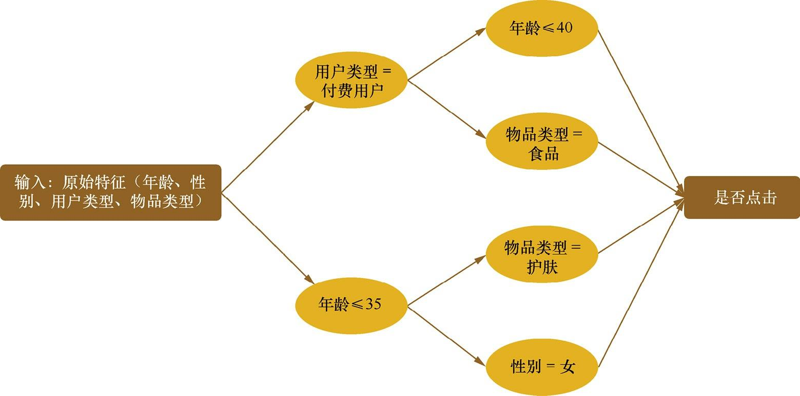
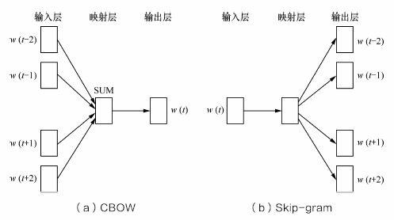

# 第一章 特征工程

## 引导语

一句业界经典的话：“Garbage in, garbage out”。对于机器学习问题，数据和特征决定了结果的上限，而模型、算法的选择和优化则是在逐步接近这个上限。特征工程从本质上来讲，是一个表示和展现数据的过程。在实际工作中，特征工程旨在**去除原始数据中的杂质和冗余**，设计更**高效**的特征以刻画求解的问题与预测模型之间的关系。
 本章主要讨论两种常用数据类型，结构化数据和非结构化数据。

- 结构化数据。可以看作**关系型数据库的一张表**，每一列都有清晰的定义，包含数值型、类别型两种基本类型；每行表示一个样本的信息。
- 非结构化数据。主要包括文本、图像、音频、视频数据，其包含的信息无法用一个简单的数值表示，也没有清晰的类别定义。并且每条数据的大小各不相同。

注：主要从数值表示、类别定义来区分。

## 1、特征归一化

1. 目的：消除数据特征之间的**量纲影响**，使得不同指标之间具有**可比性**。
2. 常用方法有**线性函数归一化**和**零均值归一化**：

   - 线性函数归一化(Min-Max Scaling，最大最小值归一化)，将数据映射到$[0,1]$的范围内。
     $$
     X_{norm}=\frac{X-X_{min}}{X_{max}-X_{min}}
     $$

   - 零均值归一化(Z-Score Normalization)，将数据映射到均值为0、标准差为1的分布上。
     $$
     z=\frac{x-\mu}{\sigma}
     $$

3. 如果模型用梯度下降来进行求解，数据归一化主要对**收敛速度**产生影响。将各个特征映射到同一个区间内，可以使得各个特征的更新速度变得更一致，容易更快地通过梯度下降找到最优解。

4. 通过梯度下降求解的模型通常需要归一化，包括线性回归、逻辑回归、支持向量机、神经网络等。但**对于决策树并不适用**。例如C4.5节点分裂主要依据信息增益比，而归一化并不会改变信息增益比。
   注：经过实践，确实是这样，有可能归一化之后反而使决策树性能下降。

## 2、类别型特征

1. 类别型特征指在**有限选项**内取值的特征。通常为字符串形式。决策树等少数模型能直接处理字符串形式的输入，逻辑回归、SVM等类别型特征必须处理成**数值型特征**才能正确工作。

2. 处理类别型特征的方法：

   - **序号编码**，如成绩可以转化为高、中、低三档，分别用3、2、1表示，转换后依然保留了大小关系。

   - **one-hot编码**，通常用于处理类别间不具有大小关系的特征，如各种血型，A型编码为(1,0,0,0)，B型编码为(0,1,0,0)。
      one-hot编码需要注意：当类别取值较多时，用one-hot就会非常稀疏，可以用**稀疏向量形式输入**来节省空间，目前大部分算法都接受这种输入形式。但是高维one-hot编码会有几个问题：
      1. knn中高维空间下**很难有效衡量两点的距离**。
      2. 逻辑回归中参数数量会随维度增高而增多，容易引起**过拟合**。通常只有部分维度对分类、预测有帮助，因此可以配合**特征选择**来降维。
         注：也就是说需要酌情筛掉。

   - **二进制编码**，和one-hot的思想差不多，它允许多位为1。本质是利用二进制对ID进行hash映射，比one-hot节省空间。

   - 还有其他编码方式：Helmert Contrast、Sum Contrast、Polynomial Contrast、Backward Difference Contrast。

## 3、高维组合特征的处理

1. 目的：提高复杂关系的拟合能力。
2. 组合特征是指把一阶**离散特征**两两组合，构成高阶组合特征。
    注：注意是离散特征。
    例如将语言(中文、英文)；剧集类型(电影、电视剧)两个一阶离散特征组合为二阶特征，则有中文电影、中文电视剧、英文电影、英文电视剧四种类型。
    假设数据的特征向量为$X=(x_1,x_2,...,x_k)$，则有$Y=sigmoid\sum_i\sum_j w_{ij}<x_i,x_j>$。如上面的问题，则的维$w$度为2*2=4。
3. 当引入ID类型的特征时，通常需要**降维**。如推荐问题，通常有如下的组合特征：

| 是否点击 | uid=1,item id=1 | uid=2,item id=1 | uid=2,item id=1 | ...  | uid=m,item id=n |
| -------- | --------------- | --------------- | --------------- | ---- | --------------- |
| 0        | 1               | 0               | ...             | 0    | 0               |
| 1        | 0               | 1               | ...             | 0    | 0               |
| ...      | ...             | ...             | ...             | ...  | ...             |

如上表，则要学习的参数规模为$m\times n$，参数规模太大，一种行之有效的方法是将用户和物品分别用$k$维的低维向量表示($k$远小于$m$和$n$)，则参数的规模变为$m\times k+n\times k$。实际是**矩阵分解**。

## 4、组合特征

简单地将特征两两组合容易存在**参数过多**、**过拟合**等问题。本节提供了一种基于决策树的组合特征寻找方法。
 例如一个点击预测问题：输入特征有年龄、性别、用户类型(试用期/付费)、物品类型(护肤/食品)。我们构造一个决策树如下：

从根节点到叶节点的每条路径都可以看成一种特征组合的方式。根据上面建立的决策树，我们有4条路径。则可以得到以下样本的编码方式。

| 是否点击 | 年龄 | 性别 | 用户类型 | 物品类型 | 编码      |
| -------- | ---- | ---- | -------- | -------- | --------- |
| 是       | 28   | 女   | 免费     | 护肤     | (1,1,0,0) |
| 否       | 36   | 男   | 付费     | 食品     | (0,0,1,1) |

如第一条样本，满足图上的下面的两条路径，则可编码为(1,1,0,0)。
 注：感觉这种方式确实是组合特征降维的比较好的方式，但是问题是首先要建立一颗树。

## 5、文本表示模型

1. 词袋模型和N-gram模型

   - **词袋模型**是最基础的文本表示模型。是将文章以词为单位切分开，忽略词的出现顺序，将文章表示成一个长向量，每一维代表一个单词，该维的权重表示重要程度。常用**TF-IDF**来计算权重。(注意逆文档频率是要取$log$对数的)

   - **N-gram**是指有些词组不能拆开，那么由这个词组成的词组(N-gram)也作为一个单独的特征放到向量表示中，构成N-gram模型。

注：总的来说就是，TF-IDF是词袋模型中的一种计算权重的方法，N-gram是一种为了解决词组不可分的一种方法，也属于词袋模型，最后依然要用词袋模型来表示。

2. 主题模型
   词袋模型和N-gram模型无法识别两个不同的词或词组具有相同的主题，主题模型可以将具有**相同主题的词或词组映射到同一维度上**，映射到的这一维度表示某个主题。主题模型是一种特殊的概率图模型，后面第六章第五节会讲。

3. 词嵌入
   词嵌入是一类将词向量化的模型的统称，核心思想是将每个词都映射到低维空间($k=50~300$)上的一个稠密向量。$k$维空间的每一维也可以看作一个隐含的主题，但没有主题模型那样直观。

## 6、Word2Vec

1. Word2Vec是2013年提出的，是目前最常用的词嵌入模型之一。它实际是一种

   浅层的神经网络模型，有两种网络结构：CBOW(Continues Bag of Words)和Skip-gram。

   COBW根据上下文出现的词语来预测当前词的生成概率，Skip-gram根据当前词来预测上下文中各词的生成概率。结构如下图：

   

   $w(t)$即当前词，$w(t-2), w(t-1), w(t+1), w(t+2)$即上下文中出现的词，所谓的滑动窗口大小就是上下文取词个数，为2。

2. CBOW的训练方式：模型有输入层、映射层、输出层。

   - 输入层是one-hot编码的上下文词，如果词汇表中单词总数为$N$，则输入层的词表示即为$N$维度one-hot向量。

   - 映射层(隐含层)有$K$个隐含单元，即我们要得到的$K$维词嵌入向量，这里就是$K$个隐含单元。映射层的值由输入层的$N$维向量和$N \times K$维权重矩阵计算得到。
      注：CBOW模型需要将输入词计算的隐含单元值求和，比Skip-gram多这一部分。

   - 输出层向量的值由隐含层的$K$维向量和$K\times N$维向量计算得到，输出也是$N$维向量。但是这里的输出向量并不能保证所有维度加起来为1(one-hot编码加起来就为1)，要通过**Softmax**激活函数进行归一化。

   - 训练的目标是使得语料库中所有单词的整体生成概率最大化。可以用反向传播，沿梯度更优的方向更新权重，但是由于Softmax存在归一化项，推导出来的迭代公式需要对词汇表中所有单词进行遍历(毕竟是$N$维词向量)，所以每次迭代过程非常缓慢。有Hierarchical Softmax和Negative Sampling两种改进方法。

   - 得到训练出来的各词对应的向量：训练得到的维度为$N \times K$和$K\times N$的矩阵，可以选择任意一个作为$N$个词的$K$维词向量。

3. Word2Vec和LDA的区别和联系：

   - LDA利用**文档中单词的共现关系**来对单词按主题聚类，可以理解为将“文档-单词”矩阵分解为“文档-主题”和“主题-单词”两个概率分布。但Word2Vec更多融入了**上下文共现的特征**，是对“上下文-单词”矩阵进行学习。

   - 主题模型通过一定的结构调整可以基于“上下文-单词”单词矩阵进行主题推理，词嵌入方法也可以根据“文档-单词”矩阵学习出词的隐含向量表示。

   - 最大的区别是模型本身。主题模型是一种基于**概率图模型的生成式模型**，其似然函数可以写成若干条件概率连乘的形式，其中包括需要推测的隐含变量(即主题)。词嵌入一般表达为**神经网络的形式**，似然函数定义在网络的输出之上，需要通过学习网络的权重得到单词的稠密向量表示。

## 7、图像数据不足时的处理方法

1. 一个模型能提供的信息一般来源于两个方面：一是**训练数据**中蕴含的信息；二是模型的形成过程中(包括构造、学习、推理等)人提供的**先验信息**。
2. 训练不足时则要提供更多先验信息。先验信息作用在模型上，如让模型采用特定的**内在结构**、**条件假设**或添加一些**约束条件**。先验信息也可以作用在数据集上，如根据特定的先验假设**调整**、**变换**和**扩展**数据集，让其展现出更多更有用的信息。
3. 图像分类任务中，训练数据不足的问题主要表现在过拟合方面，处理方法可以分为两类：

   - 基于模型的方法：主要是采用降低过拟合风险的措施，包括**简化模型**(将非线性模型简化为线性模型)、添加**约束项**以缩小假设空间(L1/L2正则项)、**集成学习**、**Dropout**超参数等。

   - 基于数据的方法：主要通过**数据扩充**(Data Augmentation，数据增强)，对原始数据进行适当变换以达到扩充数据集的效果。
      具体到图像分类，有四种变换方法：(1)随机旋转、平移、缩放、裁减、填充、左右翻转等，对应不同角度的观察结果。(2)对像素添加噪声扰动，如椒盐噪声、高斯白噪声等。(3)颜色变换。(4)改变亮度、清晰度、对比度、锐度等。
   - 除了在图像空间进行变换，还可以对图像进行特征提取，然后在**图像的特征空间内进行变换**，利用一些通用的数据扩充或上采样技术如SMOTE等进行扩充。这些都是一些启发式的变换方法，还可以通过**GAN**等生成模型合成新样本，还可以借助其他模型或数据来进行**迁移学习**。

